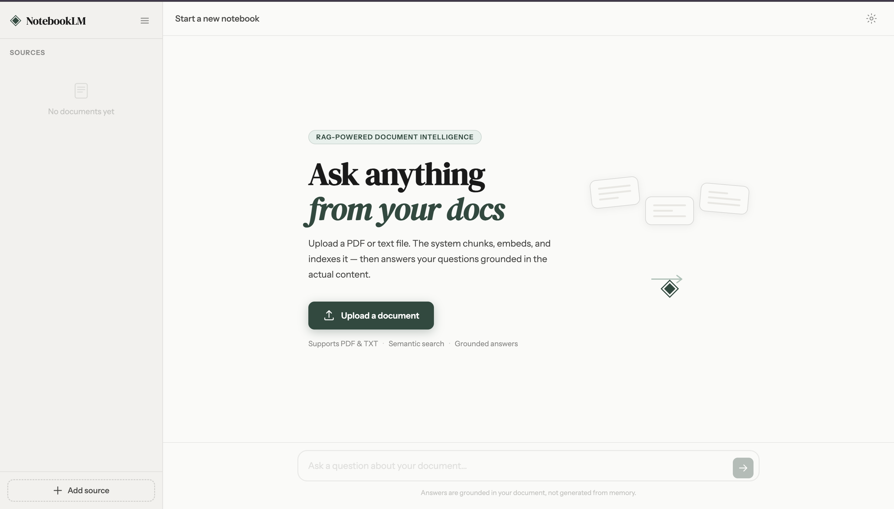
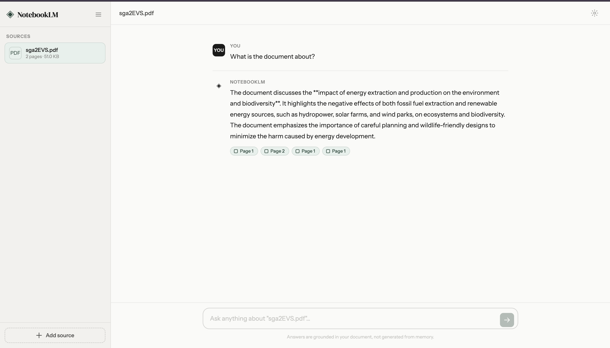

# NotebookLM RAG

A full-stack RAG (Retrieval-Augmented Generation) application — upload any PDF or text file and chat with it using grounded answers powered by **Groq** (free API) and **Qdrant** vector database.

---




## Folder Structure

```
notebooklm-rag/
│
├── frontend/                    ← Static HTML/CSS/JS (no build step)
│   ├── index.html
│   ├── style.css
│   └── app.js
│
├── backend/                     ← Node.js + Express API
│   ├── src/
│   │   ├── index.js             ← Server entry point
│   │   ├── routes/
│   │   │   ├── upload.js        ← POST /api/upload
│   │   │   ├── index.js         ← POST /api/index
│   │   │   ├── query.js         ← POST /api/query
│   │   │   └── source.js        ← DELETE /api/source/:id
│   │   ├── services/
│   │   │   ├── chunker.js       ← Recursive text splitter
│   │   │   └── embeddings.js    ← Groq embeddings + Qdrant CRUD
│   │   └── middleware/
│   │       └── upload.js        ← Multer config (PDF/TXT, 20MB)
│   ├── uploads/                 ← Temp file storage (gitignored)
│   ├── .env.example
│   ├── .gitignore
│   ├── package.json
│   ├── docker-compose.yml       ← Runs Qdrant locally
│   └── README.md
│
└── README.md                    ← This file
```

---

## Tech Stack

| Layer | Tool | Notes |
|-------|------|-------|
| Frontend | Vanilla HTML/CSS/JS | No framework, no build step |
| Backend | Node.js + Express | ES Modules, serverless-optimized |
| Embeddings | Hugging Face Inference API | `sentence-transformers/all-MiniLM-L6-v2` (Free, 384-dim) |
| LLM | Groq `llama-3.3-70b-versatile` | Free, highly capable generator |
| Reranker/Judge | Groq `llama-3.1-8b-instant` | Free, ultra-fast pre/post-retrieval processing |
| Vector DB | Qdrant | Local via Docker or Qdrant Cloud |
| PDF parsing | `pdf-parse` | Pure JS, no Python |

---

## 🏗️ Advanced RAG Architecture

This project implements an Advanced RAG pipeline to ensure highly accurate, grounded, and context-rich answers:

1. **Pre-Retrieval: Query Rewriting**
   - Vague or conversational queries are processed by `llama-3.1-8b-instant` to generate a standalone search query optimized for semantic search.
2. **Ingestion: Parent-Child Chunking**
   - Documents are split into large **Parent Chunks** (1,200 characters) to preserve context and smaller **Child Chunks** (300 characters) for high-resolution vector matching.
   - Child chunks are stored in Qdrant with their parent texts mapped in the metadata. Retrieval matches on children, but feeds the parent text as context to the LLM.
3. **Post-Retrieval: LLM Reranking**
   - Retrieves `k = 8` child chunks from Qdrant, then utilizes `llama-3.1-8b-instant` to rerank and filter down to the top 4 most relevant parent chunks.
4. **Self-Correction: LLM-as-a-Judge Loop**
   - The generated response is evaluated by a QA Judge (`llama-3.1-8b-instant`) for **Faithfulness** (no hallucinations relative to context) and **Answer Relevance**.
   - If it fails, the Judge provides correction feedback, triggering a self-correction loop to regenerate a refined answer.

---

## Quick Start

### Step 1 — Get a free Groq API key
Sign up at https://console.groq.com — no credit card required.

### Step 2 — Start Qdrant (vector database)
```bash
cd backend
docker compose up -d
```
Dashboard available at: http://localhost:6333/dashboard

### Step 3 — Configure environment
```bash
cd backend
cp .env.example .env
# Open .env and paste your GROQ_API_KEY
```

### Step 4 — Install & run the backend
```bash
cd backend
npm install
npm start
```
Server runs at: **http://localhost:3000**

### Step 5 — Open the frontend
Just open `frontend/index.html` in your browser — or serve it:
```bash
cd frontend
npx serve .
```

---

## API Endpoints

| Method | Endpoint | Body | Response |
|--------|----------|------|----------|
| `POST` | `/api/upload` | `multipart/form-data` — `file` | `{ fileId, fileName }` |
| `POST` | `/api/index` | `{ fileId }` | `{ collectionName, pageCount, chunkCount }` |
| `POST` | `/api/query` | `{ query, collectionName }` | `{ answer, chunks[] }` |
| `DELETE` | `/api/source/:fileId` | — | `{ ok }` |
| `GET` | `/health` | — | `{ ok: true }` |

---

## Deployment

### Backend → Render.com (free)
1. Push the `backend/` folder to GitHub
2. Create a **Web Service** on Render
3. Set env vars: `GROQ_API_KEY`, `QDRANT_URL`, `PORT`
4. Start command: `npm start`

### Vector DB → Qdrant Cloud (free tier)
1. Sign up at https://cloud.qdrant.io
2. Create a free cluster, copy the URL
3. Set `QDRANT_URL` in your Render env vars

### Frontend → Vercel / Netlify (free)
1. Update `API_BASE` in `frontend/app.js` to your Render URL
2. Deploy the `frontend/` folder as a static site

---

## Groq Free Tier Limits

| Model | Limit |
|-------|-------|
| `nomic-embed-text-v1.5` | 100 req/min, 15,000 req/day |
| `llama-3.3-70b-versatile` | 30 req/min, 14,400 req/day |
